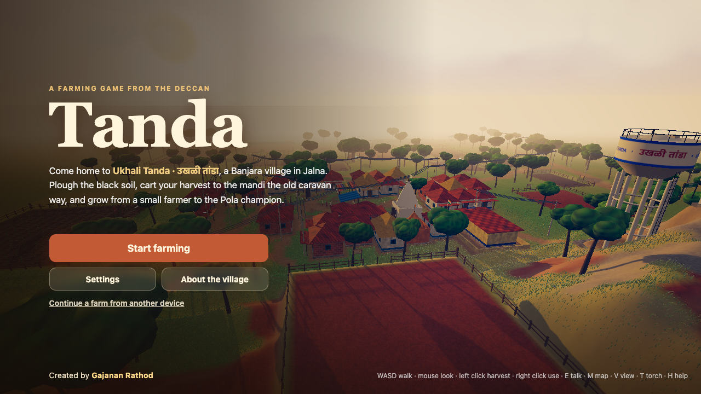
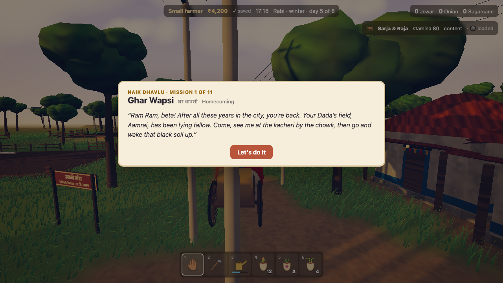
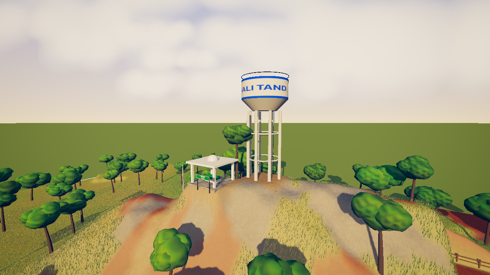
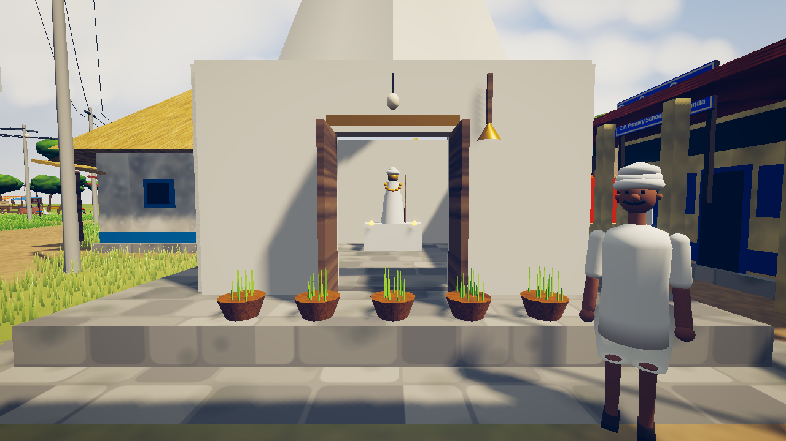
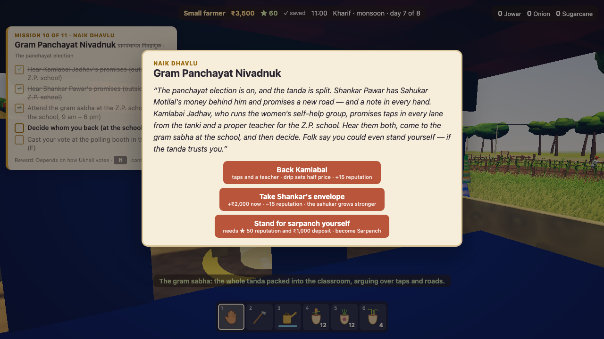

# Tanda · तांडा

**A cinematic farming game set in Ukhali Tanda, a Banjara village in Jalna, Maharashtra.**

Your home is **Rathod Bhuvan**, an old two-storey wooden wada at the edge of the village.

You come home from the city to your Dada's fallow field. Plough the black soil, grow jowar, onion
and sugarcane, carry water from the vihir, cart your harvest to the mandi the old Banjara caravan
way, buy land, stand in the panchayat election, and lead your bulls in the Bail Pola procession.

It runs in the browser, with no install and no sign-up.

[](https://github.com/gajanansr/tanda-an-village/actions/workflows/ci.yml)


Created by **[Gajanan Rathod](https://github.com/gajanansr)**.



| | |
|---|---|
|  |  |
|  |  |

---

## What's in the game

- **A real village.** The roads and lanes of Ukhali come from OpenStreetMap. The field strips, the
  tekdi, the red scrub and the field vihir are laid out from satellite imagery. Around the chowk are
  the Sevalal Maharaj and Hanuman mandirs, the Z.P. school, Pir Baba's shrine on the hill, and a
  water tank painted "उखळी तांडा".
- **Real farming.** Plough, sow, water and harvest. Crops keep growing from timestamps while you're
  away, and soil wears out and recovers. Drip irrigation, electric pumps, and Khillari bulls that
  plough a whole row at once.
- **An economy.** Daily mandi prices follow the seasons, the monsoon, and gluts and shortages. There
  is a village trader and a town mandi (reached by bullock cart), a seed shop, a godown, bank and
  sahukar loans, a land market with NPC buyers, and a 14-day ledger.
- **A story in 11 missions.** Ghar Wapsi, Pehli Fasal, Vihir ka Paani, Sitabai's order, Sarja and
  Raja, Teej, the caravan, the moneylender's debt, the land deal, the **panchayat election** (back
  Kamlabai, take Shankar's envelope, or stand for sarpanch yourself) and **Bail Pola**. Your choices
  change your reputation, your prices, and how the village ends up.
- **A living tanda.** Neighbours hoe their own fields, women carry matkas from the well, children
  play in the chowk, and people steer round each other and the houses. At night tungsten bulbs come
  on, and you carry a torch (T).
- **Banjara culture.** Mirror-work ghaghras, bangles and coin-edged odhnis, torans over the doors,
  Teej sprout baskets, and the Naik who heads the tanda.
- **Saves and a leaderboard.** You start instantly as a guest. A recovery code moves your farm to
  another device, and a public leaderboard ranks farmers by net worth.
- **Look and sound.** Smooth terrain, wind-blown grass, painted skies, bloom and colour grading.
  Every sound is synthesized in WebAudio.

## Play

**Controls**

| Key | What it does |
|---|---|
| **WASD** | walk |
| **Shift** | run |
| **Space** | jump |
| **Mouse** | look |
| **Left click** | harvest |
| **Right click** | use the tool in your hand (plough, sow, water, fill the can) |
| **1–6** | pick a tool |
| **E** | talk / trade |
| **M** | map |
| **L** | leaderboard |
| **V** | first / third person |
| **T** | torch |
| **R** | cart |
| **F** | feed or decorate the bulls |
| **G** / **P** | tie the bulls / let them plough the field |
| **Z** | sleep till morning (at night, from anywhere) |
| **H** | help |

The goal card (top left) and the golden marker always show what to do next.

It needs a computer with a keyboard and mouse. On phones the game shows a short note instead.

## Run it locally

```bash
git clone https://github.com/gajanansr/tanda-an-village.git
cd tanda-an-village
npm install
npm run dev          # → http://localhost:5190
```

That's the whole game, server included. The Vite dev server also runs the API (`api/*.ts`), and
saves go to JSON files in `.data/`, so no database or accounts are needed to develop.

```bash
npm run typecheck    # TypeScript, strict
npm test             # 79 unit tests (rules, economy, land, missions, storage, API)
npm run build        # production build → dist/
```

**Scripted play-throughs** run in headless Chrome. Start the dev server first. They drive the real
UI and fail on any page error.

```bash
node scripts/m4.mjs                                                       # accounts, saves, tamper checks, two devices
node scripts/shots.mjs --name farm --eval "$(cat scripts/m3.js)"          # farming loop
node scripts/shots.mjs --name story --eval "$(cat scripts/missions.js)"   # missions through the UI
node scripts/shots.mjs --name vote --eval "$(cat scripts/election.js)"    # the election
```

The others are `m5.js` (economy), `m6.js` (land), `m7.js` (cart) and `m8.js` (bank). Screenshots
land in `out/`. `node scripts/perf.mjs [--tier low|medium|high]` measures frame rate, draw calls and
triangles by day and at night.

**Graphics quality** is picked per device (Low / Medium / High, from the GPU, cores and memory), can
be changed in Settings, and on Auto it lowers itself if the frame rate drops. See `src/client/quality.ts`.

## How it works

```
browser (Three.js)                                     Vercel functions (api/)            Supabase (Postgres)
┌──────────────────────────────┐   actions (batched)  ┌──────────────────────────┐     ┌──────────────────┐
│ render · physics · UI        │ ───────────────────▶ │ re-check every action    │ ──▶ │ kv (saves, JSONB,│
│ applies moves instantly      │ ◀─────────────────── │ with the SAME rules code │     │ versioned)       │
│ (optimistic), rolls back if  │   the true save      │ on the server's clock    │     │ leaderboard      │
│ the server says no           │                      └──────────────────────────┘     └──────────────────┘
└──────────────────────────────┘                ▲ src/shared/ — the rules, used by both sides
```

- **`src/shared/`** holds the game rules, in pure TypeScript used by both the client and the server:
  - `world.ts`: the seeded village generator, including the OSM roads
  - `rules.ts`: every action and its checks
  - `crops.ts`, `economy.ts`, `land.ts`, `bank.ts`, `bulls.ts`: the models
  - `missions.ts`: the story
  - `save.ts`: the save format and its migrations

  Money, land and missions change only through `rules.ts`, which is why a tampered client gains
  nothing.
- **`src/client/`** is the game in the browser:
  - `scene/`: terrain, water, grass, trees, village, crops, figures and post-processing
  - `player/`: walking, camera, navigation
  - `ui/`: the HUD and panels
  - `villagers.ts`, `farmyard.ts`: the people and the bulls
  - `audio.ts`: synthesized sound
  - `net.ts`: sync with the server
- **`api/`** is the Vercel functions:
  - `session.ts`: create a guest or restore by code
  - `state.ts`: load a save
  - `act.ts`: apply a batch of moves
  - `leaderboard.ts`: the public board
  - `dev.ts`: a dev-only time skip, which returns 404 in production

  Saves are compare-and-set on a `rev` number, so two devices playing at once never lose moves.
- **`api/_lib/store.ts`** holds the storage backends: Supabase over REST, files, or memory. The same
  contract tests run on all three.

More detail on how it was built and why is in [PLAN.md](PLAN.md).

## Deploy your own

1. **Supabase:** create a project (the Mumbai region is closest to Maharashtra). In the SQL Editor,
   run [`supabase/schema.sql`](supabase/schema.sql). Row-level security is on with no policies, so
   only the server can touch the data.
2. **Vercel:** import this repo. Under **Environment Variables**, set `SUPABASE_URL` and
   `SUPABASE_SERVICE_ROLE_KEY`, both from Supabase → Settings → API. The service key stays server-side
   and never goes in client code.
3. Deploy, then open `/api/health`. It should say `"store":"SupabaseStore"`.
4. Optional: add a custom domain in Vercel.

Without the Supabase keys, the API refuses to run on Vercel instead of silently losing saves.

## Contributing

Contributions are welcome: code, art, sound, translations (Marathi, Banjari/Gor boli, Hindi), and
especially **corrections from people who know Banjara life and Marathwada villages**. Read
[CONTRIBUTING.md](CONTRIBUTING.md) to get started, and please follow the
[Code of Conduct](CODE_OF_CONDUCT.md).

Good first issues: new crops (cotton, tur, soybean), a Marathi UI toggle, more villager routines,
festival decorations, and mobile touch controls.

## Credits

- Created by **Gajanan Rathod**.
- Map data © [OpenStreetMap](https://www.openstreetmap.org/copyright) contributors (ODbL), in
  `src/shared/ukhali-osm.ts`.
- Built with [Three.js](https://threejs.org), [Vite](https://vitejs.dev), [Vercel](https://vercel.com)
  and [Supabase](https://supabase.com).
- Ukhali Tanda is a real place. The houses, people and stories in the game are imagined, with respect
  for the Banjara community. If something feels wrong, please open an issue.

## License

[MIT](LICENSE) © Gajanan Rathod
